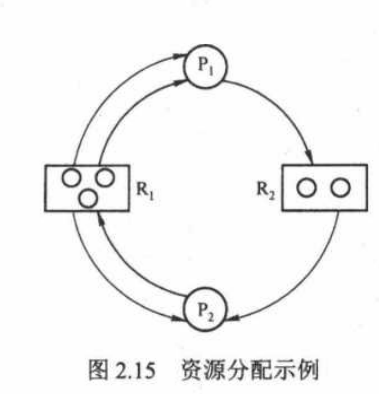
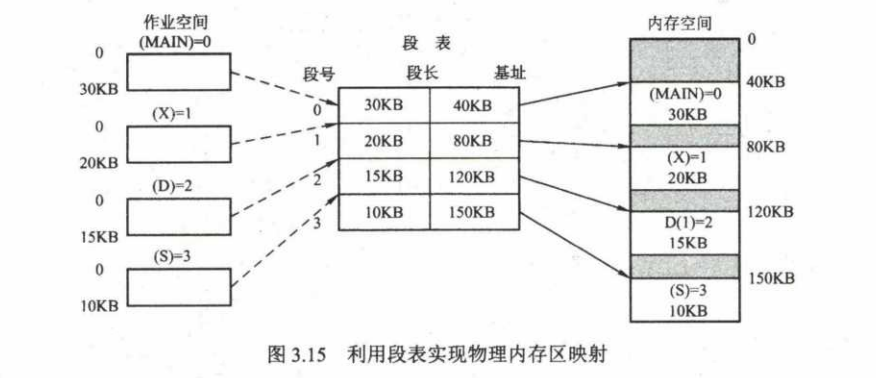
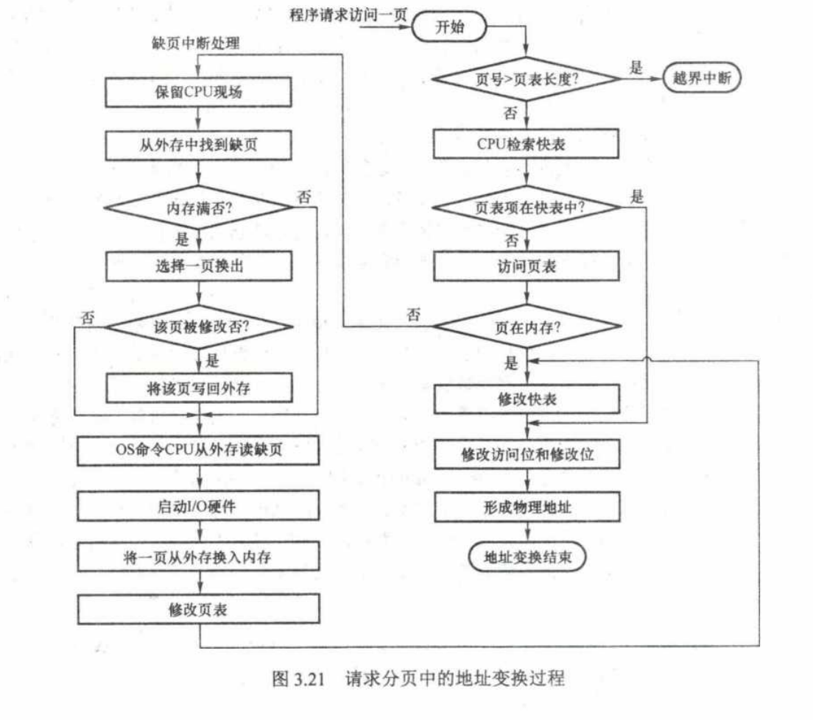

## 第 2 章 进程与线程

### 2.3 同步与互斥

#### 2.3.1 同步与互斥的基本概念

**1、临界资源**

将一次仅允许一个进程使用的资源称为临界资源。对临界资源的访问必须互斥的进行，访问临界资源的那段代码称为临界区。

1. 进入区
2. 临界区
3. 退出区
4. 剩余区

**2、同步**

同步也称直接制约关系，是指为完成某种任务二建立的两个或多个进程，这些进程因为需要在某些位置上协调它们的工作次序而等待、传递信息所产生的制约关系。

**3、互斥**

互斥也称间接制约关系。当一个进程进入临界区使用临界资源时，另一个进程必须等待，当占用临界资源的进程退出临界区 后，另一个进程才允许访问此临界资源。

为禁止两个进程同时进入临界区，同步机制应遵循以下准则：

1. 空闲让进。临界区空闲时，可以允许一个请求进入临界区的进程立即进入临界区。
2. 忙则等待。当已有进程进入临界区时，其他试图进入临界区的进程必须等待。
3. 有限等待。对请求访问的进程，应保证能在有限时间内进入临界区。
4. 让权等待。当进程不能进入临界区时，应立即释放处理器，防止进程忙等待。

#### 2.3.2 实现临界区互斥的基本方法

**1、软件实现方法**

在进入区设置并检查一些标志来表明是否有进程在临界区中，若已有进程在临界区中，在进入区通过循环检查进行等待，进程离开临界区后则在退出区修改标志。

1）算法一：单标志法。该算法设置一个公共整型变量turn，用于指示被允许进入临界区的进程编号。若turn=0，则允许P~0~进程进入临界区。该算法可以保证每次只允许一个进程进入临界区。但两个进程必须交替进入临界区，若某个进程不再进入临界区，则另一个进程也将无法在进入临界区（违背“空闲让进”）。

```c
// P0进程
while(turn != 0);			// 进入区
critical section;			// 临界区
turn = 1；						 // 退出区
remainder section;    // 剩余区

// P1进程
while(turn != 1);			// 进入区
critical section;			// 临界区
turn = 0；						 // 退出区
remainder section;    // 剩余区
```

2）算法二：双标志法先检查。

在每个进程访问临界资源之前，先查看临界资源是否正在被访问，若正在被访问，该进程需要等待。否则，进程才能进入自己的临界区。设置一个布尔型的flag数组，如第i个元素flag[i]为FALSE，表示P~i~进程未进入临界区，如为TRUE，表示P~i~进程进入临界区。

```c
// pi进程
while(flag[j]);				// 进入区
flag[i] = TRUE;				// 进入区
critical section;			// 临界区
flag[i] = FALSE;			// 退出区
remainder section;		// 剩余区

// pj进程
while(flag[i]);				// 进入区
flag[j] = TRUE;				// 进入区
critical section;			// 临界区
flag[j] = FALSE;			// 退出区
remainder section;		// 剩余区
```

优点：不用交替使用，可连续使用。缺点：两进程可能会同时进入临界区，违背“忙则等待”。

3）算法三：双标志法后检查

现将自己标志设为TRUE，再检查对方的状态标志，若对方的状态标志为TRUE，则进程等待。

```c
// pi进程
flag[i] = TRUE;				// 进入区
while(flag[j]);				// 进入区
critical section;			// 临界区
flag[i] = FALSE;			// 退出区
remainder section;		// 剩余区

// pj进程
flag[j] = TRUE;				// 进入区
while(flag[i]);				// 进入区
critical section;			// 临界区
flag[j] = FALSE;			// 退出区
remainder section;		// 剩余区
```

可能会出现死锁的情况。

4）算法四：Peterson's Algorithm。每个进程先设置自己的标志后再设置turn标志。这时，同时在检测另一个进程标志和允许进入标志，以便保证两个进程同时要求进入临界区时，只允许一个进程进入临界区。

```c
// pi 进程：
flag[i] = TRUE; turn = j;			// 进入区
while(flag[j] && turn==j);		// 进入区
critical section;							// 临界区
flag[i] = FALSE;							// 退出区
remainder section;						// 剩余区

// pj 进程：
flag[j] = TRUE; turn = i;
while(flag[i] && turn == i);
critical section;
flag[i] = FALSE;
remainder section;
```

**2. 硬件实现方法**

通过硬件支持实现临界段问题的方法称为低级方法，或称元方法。

（1）中断屏蔽方法

当一个进程正在执行它的临界区代码时，防止其他进程进入其临界区的最简方法就是关中断。

（2）硬件指令方法

`TestAndSet指令`：这条指令是原子操作，即执行该代码时不允许被中断。其功能是读出指定标志后把该标志设置为真。

```c
boolean TestAndSet(boolean *lock){
  boolean old;
  old =*lock;
  *lock = true;
  return old;
}
```

可以为每个临界资源设置一个共享布尔变量lock，表示资源的两种状态：true表示正在占用，初值为false。进程进入临界区之前，利用TestAndSet检查标志lock，若无进程在临界区，则其值为false，可以进入，关闭临界资源，把lock置为true，使任何进程都不能进入临界区；若有进程在临界区，则循环检查，直至进程退出。使用该指令实现互斥的过程描述如下：

```c
while TestAndSet(&lock);
进程的临界区代码
lock=false;
进程的其他代码;
```

`Swap指令`：该指令的功能是交换两个字（字节）的内容。其功能描述如下：

```c
Swap(boolean *a, boolean *b){
    boolean temp;
    temp = *a;
    *a = *b;
    *b = temp;
}
```

注意：以上对TestAndSet和Swap指令的描述仅是功能实现，而并非软件实现的定义，事实上，它们是由硬件逻辑直接实现的，不会被中断。

用Swap指令可以简单有效的实现互斥，为每个临界资源设置一个共享布尔变量lock，初值为false；每个进程中再设置一个局部布尔变量key，用于与lock交换信息。在进入临界区前，先利用swap交换lock和key的内容，然后检查key的状态；有进程在临界区时，重复交换和检查过程，直至进程退出。

```c
key = true;
while(key != false)
    Swap(&lock, &key);
进程的临界区代码
lock = false;
进程的其他代码；
```


#### 2.3.3 互斥锁

解决临界区最简单的工具就是互斥锁。一个进程在进入临界区时应获得锁，在退出临界区时释放锁。函数acquire()获得锁，函数release()释放锁。

每个互斥锁有一个布尔变量available ，表示锁是否可用。如果锁是可用的，调用acquire会成功，且锁不再可用。当一个进程试图获取不可用锁时，会被阻塞，直到锁被释放。

```c
acquire(){
    while(!available);
    available = false;
}
release(){
    available = true;
}
```

acquire ()或release()的执行必须是原子操作，因此互斥锁通常采用硬件机制来实现。

互斥锁的主要缺点就是忙等待，当有一个进程在临界区中，任何其他进程在进入临界区时必须连续循环调用acquire。当多个进程共享同一个CPU时，就浪费了CPU周期。因此，互斥锁通常用于多处理器系统，一个线程可以在一个处理器上等待，不影响其他线程的执行。

#### 2.3.4 信号量

信号量机制是一种功能较强的机制，可用来解决互斥与同步问题，它只能被两个标准的原语wait(S)和signal（S）访问，也可以记为“P操作”和“V操作”。

**1、整型信号量**

整型信号量被定义为一个用于表示资源数目的整型量S，wait和signal操作可描述为

```c
wait(S){
    while(S<=0);
    S=S-1;
}
signal(S){
    S=S+1;
}
```

在整型信号量机制中的wait操作，只要信号量S<=0,就会不断地测试，因此，该机制并未遵循“让权等待”的原则。

**2、记录型信号量**

记录型信号量机制是一种不存在“忙等”现象的进程同步机制。除了需要一个用于代表资源数目的整型变量value外，再增加一个进程链表L，用于链接所有等待该资源的进程。记录型信号量得名于采用了记录型的数据结构。记录型信号量可描述为

```java
typedef struct{
    int value;
    struct process *L;
} semaphore;

void wait(semaphore S){
    S.value--;
    if(S.value < 0){
        add this process to S.L;
        block(S.L);
    }
}

void signal(semaphore S){
    S.value++;
    if(S.value <= 0){
        remove a process P from S.L;
        wakeup(P);
    }
}
```

**3、利用信号量实现同步**

信号量机制能用于解决进程间的各种同步问题。设S为实现进程P~1~,P~2~同步的公共信号量，初值为0.进程P~2~中的语句y要使用进程P~1~中语句x的运行结果，所以只有当语句x执行完成之后语句y才可以执行。其实先进程同步的算法如下：

```c
semaphore S = 0;			// 初始化信号量
P1(){
    x;						// 语句x
    V(S);					// 告诉进程P2，语句x已经完成
    ...
}
P2(){
    ...
    P(S);					// 检查语句x是否运行完成
    y;						// 检查无误，运行y语句
    ...
}
```

**4、利用信号量实现进程互斥**

信号量机制也能很方便的解决进程互斥问题。设S为实现进程P~1~,P~2~互斥的信号量，由于每次只允许一个进程进入临界区，所以S的初值应为1（即可用资源数为1），只需把临界区置于P(S)和V(S)之间，即可实现连个进程对临界资源的互斥访问。其算法如下：

```c
semaphore S = 1;			// 初始化信号量
P1(){
    ...
    P(S);					// 准备开始访问临界资源,加锁
    进程P1的临界区;
    V(S);					// 访问结束，解锁
}
P2（）{
    ...
    P(S);
    进程P2的临界区；
    V(S);
}
```

**5、 利用信号量实现前驱关系**


```c
semaphore a1=a2=b1=b2=c=d=e=0;				// 初始化信号量
S1(){
    ...;
    V(a1);V(a2);							// S1 已经完成
}
S2(){
    P(a1);									// 检查S1是否已经完成
    ...;
    V(b1);V(b2);							// S2 已经运行完成
}
S3(){
    P(a2);									// 检查S1是否运行完成
    ...;
    V(c);									// S3 已经运行完成
}
S4(){
    P(b1);									// 检查S2是否运行完成
    ...;
    V(d);									// S4已经运行完成
}
S5(){
    P(b2);									// 检查S2是否已经完成
    ...;
    V(e);									// S5已经运行完成
}
S6(){
    P(c);									// 检查S3是否已经完成
    P(d);									// 检查S4是否已经完成
    P(e);									// 检查S5是否已经完成
    ...;
}
```


#### 2.3.5 管程

在信号量机制中，每个要访问临界资源的进程都必须自备同步的PV操作，大量分散的同步操作给系统管理带来了麻烦，且容易因同步操作不当而导致系统死锁。于是，便产生了一种新的进程同步工具——管程。管程的特性保证了进程互斥，无需程序员自己实现互斥，从而降低了死锁发生的可能性。同时管程提供了条件变量，可以让程序员灵活的实现进程同步。

**1、管程的定义**

管程：共享资源的数据结构 + 对该数据结构实施操作的一组过程所组成的资源管理程序。

管程定义了一个数据结构和能为并发进程所执行（在该数据结构上）的一组操作。

管程由四部分组成：

1. 管程的名称。
2. 局部于管程内部的共享数据结构说明。
3. 对该数据结构进行操作的一组函数。
4. 对局部于管程内部的共享数据设置初始值的语句。

```c
monitor Demo{ // 定义一个名称为“Demo"的管程
    
    // 定义共享数据结构
    共享数据结构s；
    
    // 对共享数据结构初始化的语句
    init_code(){
        S=5;
    }
    
    // 定义管程的操作函数
    take_away(){
        对共享数据结构x的一系列处理
        S--；
    }
    
    // 定义管程的操作函数
    give_back(){
        对共享数据结构的一系列操作
    }
}
```

**2、条件变量**

条件变量用于控制进程的阻塞。通常一个进程被阻塞的原因可以有很多个，因此在管程中设置了多个条件变量。每个条件变量保存一个等待队列，用于记录因该条件变量而阻塞的所有进程，对条件变量只能进行两种操作，即wait和signal。

`x.wait`：当x对应的条件不满足时，正在调用管程的进程使用`x.wait`将自己插入x条件的等待队列，并释放管程。此时其他进程可以使用该管程。

`x.signal`：x对应的条件发生了变化，则调用`x.signal`，唤醒一个因x条件而阻塞的进程。

```c
monitor Demo{
    共享数据结构 S;
    condition x;
    init_code(){ ... }
    take_away(){
        if(S <= 0)  x.wait();	// 资源不够，在条件变量x上阻塞等待
        资源充足，分配资源，做一系列相应处理；
    }
    give_back(){
        归还资源，做一系列相应处理
        if(有进程在等待)  x.signal(); // 唤醒一个阻塞进程
    }
}
```

条件变量和信号量的比较：

相似点：条件变量的wait/signal操作类似于信号量的P/V操作，可以实现进程的阻塞/唤醒。

不同点：条件变量是"没有值"的,仅实现了排队等待功能；而信号量是有值的，信号量的值反映了剩余资源数，而在管程中，剩余资源数用共享数据结构记录。


#### 2.3.6 经典同步问题

**1、生产者-消费者问题**

**问题描述：**一组生产者进程和一组消费者进程共享一个初始为空、大小为n的缓冲区，只有缓冲区没满时，生产者才能把消息放入缓冲区，否则必须等待；只有缓冲区不空时，消费者才能从缓冲区中取出消息，否则必须等待。由于缓冲区是临界资源，它只允许一个生产者放入消息，或一个消费者从中取出消息。

**问题分析：**

1. 关系分析：生产者和消费者对缓冲区互斥访问是互斥关系，同时生产者和消费者又是一个相互协作的关系，只有生产者生产之后，消费者才能消费，它们也是同步关系。
2. 整理思路：只有生产者和消费者两个进程，正好这两个进程存在着互斥关系和同步关系。那么需要解决的是互斥和同步PV操作的位置。
3. 信号量设置：信号量mutex作为互斥信号量，用于控制互斥访问缓冲池，互斥信号量初值为1；信号量full用于记录当前缓冲池中”满“缓冲区数，初值为0。信号量empty用于记录当前缓冲池中的”空“缓冲区数，初值为n。

```c
semaphore mutex = 1;						// 临界区互斥信号量
semaphore empty = n;						// 空闲缓冲区
semaphore full = 0;							// 缓冲区初始化为空
producer(){
    while(1){
        produce an item in nextp;			// 生产数据
        P(empty);							// 获取空缓冲区单元
        P(mutex);							// 进入临界区
        add nextp to buffer;				// 将数据放入缓冲区
        V(mutex);							// 离开临界区，释放互斥信号量
        V(full);							// 满缓冲区加1
    }
}
consumer(){
    while(1){
        P(full);
        P(mutex);
        remove an item from buffer;
        V(mutex);
        V(empty);
        consume the item;
    }
}
```


另一个复杂的生产者—消费者问题

**问题描述：**桌子上有一个盘子，每次只能香气中放入一个水果。爸爸专向盘子中放苹果，妈妈专向盘子中放橘子，儿子专等吃盘子中的橘子，女儿专等吃盘子中的苹果。只有盘子为空时，爸爸或妈妈才可向盘子中放一个水果；仅当盘子中有自己需要的水果时，儿子或女儿可以从盘中取出。

**问题分析：**

1. 关系分析：爸爸和妈妈是互斥关系、爸爸和女儿、妈妈和儿子是同步关系，儿子和女儿之间没有同步和互斥关系。
2. 整理思路：这里有四个进程，可以抽象为两个生产者和两个消费者被链接到大小为1的缓冲区上。
3. 信号量设置：首先，将信号量plate设置互斥信号量，表示是否允许向盘子里放入水果，初值为1表示允许放入，且只允许放入一个。信号量apple表示盘子中是否有苹果，初值为0表示盘子为空，不许取，apple=1表示可以取。信号量orange表示盘子中是否有橘子，初值为0表示盘子为空，不许取。

```c
semaphore plate = 1, apple = orange = 0;
dad(){
    P(plate);
    put an apple on the plate;
    V(apple);
}
mom(){
    P(plate);
    put an orange on the plate;
    V(orange);
}
son(){
    P(orange);
    take an apple from the plate;
    V(plate);
}
daughter(){
    P(apple);
    take an apple from the plate;
    V(plate);
}
```

**2、读者—写者问题**

**问题描述：**有读者和写者两组并发进程，共享一个文件，当两个或以上的读进程同时访问共享数据时不会产生副作用，但若某个写进程和其他进程（读或写进程）同时访问共享数据时则可能导致数据不一致的错误。因此要求：1、允许多个读者可以同时对文件执行读操作；2、只允许一个写着往文件中写数据；3、任意一个写者在完成写操作之前不允许其他读者或写者工作；4、写者执行写操作之前，应让已有的读者和写者全部退出。

**问题分析：**

1. 关系分析。读者和写者之间是互斥的，写者和写者之间也是互斥的，而读者和读者之间不存在互斥问题。
2. 整理思路。两个进程，即读者和写者。写者是比较简单的，他和任何进程互斥，用互斥信号量的P、V操作可以解决。读者问题比较复杂，他必须在实现与写者互斥的同时，实现与其他读者的同步，因此简单的一对P、V操作是无法解决问题的。这里用到了一个计数器，用它来判断当前是否有读者读文件。当有读者读文件时，写者是无法写文件的，此时读者会一直占用文件，当没有读者时，写者才可以写文件。同时，这里不同读者对计数器的访问也应该是互斥的。
3. 信号量设置。首先设置信号量count为计数器，用于记录当前读者的数量，初值为0；设置mutex为互斥信号量，用于保护更新count变量时的互斥；设置互斥信号量rw，用于保证读者和写者的互斥访问。

代码如下：

```c
int count = 0;					// 用于记录当前的读者数量
semaphore mutex = 1;			// 用于保护更新count变量时的互斥
semaphore rw = 1;				// 用于保证读者和写者互斥地访问文件
writer(){						// 写者进程
    while(1){
        P(rw);					// 互斥访问共享文件
        writing;
        V(rw);
    }
}
reader(){
    while(1){
        P(mutex);
        if(count == 0)
            P(rw);
        count++;
        V(mutex);
        reading;
        P(mutex);
        count--;
        if(count == 0)
            V(rw);
        V(mutex);
    }
}
```

在上面地算法中，读进程是优先地，即当存在读进程时，写操作将被延迟，且只要有一个读进程活跃，随后而来地读进程都将被允许访问文件。这样的方式会导致写进程可能长时间等待，且存在写进程“饿死”地情况。

若希望写进程优先，即当有读进程正在读共享文件时，有写进程请求访问，这时应禁止后续读进程地请求，等到已在共享文件地读进程执行完毕，立即让写进程执行，只有在无写进程执行地情况下，才允许读进程再次运行。为此，增加一个信号量并在上面程序地writer()和reader()函数中各增加一对PV操作，就可以得到写进程优先地解决程序。

```c
int count = 0;
semaphore mutex = 1;
semaphore rw=1;
semaphore w=1;
writer(){
    while(1){
        P(w);				// 在无写进程请求时进入
        P(rw);				// 互斥访问count变量
        writing;
        V(rw);				// 释放共享文件
        V(w);				// 恢复对共享文件地访问。			
    }
}
reader(){
    while(1){
        P(w);
        P(mutex);
        if(count == 0)
            P(rw);
        count++;
        V(mutex);
        V(w);
        reading;
        P(mutex);
        count--;
        if(count == 0)
            V(rw);
        V(mutex);
    }
}
```

**3、哲学家进餐问题**

**问题描述：**一张圆桌边上坐着5名哲学家，每两名哲学家之间地桌上摆一根筷子，两根筷子中间是一碗米饭，哲学家倾注毕生精力用于思考和进餐，哲学家在思考时，不影响其他人。只有当哲学家饥饿时，才会拿起两根筷子来进餐（一根一根拿起）。若筷子已在他人手上，则需要等待。饥饿地哲学家只有同时拿到两根筷子才可以开始进餐，进餐完毕后，放下筷子继续思考。


**问题分析：**

1. 关系分析。5名哲学家与左右邻居对其中间筷子地访问是互斥的。
2. 整理思路。显然，这里有5个进程。本题的关键是如何让一名哲学家拿到左右两根筷子而不造成死锁或饥饿现象。解决方法有两个：一是让他们同时拿两根筷子；二是对每名哲学家的动作指定规则，避免饥饿或死锁现象的发生。
3. 信号量设置。定义互斥信号量数组chopstick[5]={1,1,1,1,1},用于对5个筷子的互斥访问。哲学家按顺序编号为0~4，哲学家i左边筷子的编号为i，哲学家右边筷子的编号为（i+1）%5 。

```c
semaphore chopstick[5] = {1,1,1,1,1};
Pi(){
    do{
        P(chopstick[i]);
        P(chopstick[(i+1)/5]);
        eat;
        V(chopstick[i]);
        V(chopstick[(i+1)%5]);
        think;
    }while(1);
}
```

上述算法存在一些问题：当5名哲学家都想要进餐并分别拿起左边的筷子时，筷子已经被拿光，等到他们再想拿右边的筷子时，就全被阻塞了，因此发生了死锁。

为防止死锁发生，可对哲学家进程施加一些限制条件，比如至多允许4名哲学家同时进餐；仅当一名哲学家左右两边的筷子都可用时，才允许他抓起筷子；对哲学家顺序编号，要求奇数号哲学家先拿左边的筷子，然后拿右边的筷子，而偶数号科学家则正好相反。

**制定正确的规则如下：**假设采用第二种方法，当一名哲学家左右两边的筷子都可用时，才允许他抓起筷子。

```c
semaphore chopstick[5] = {1,1,1,1,1};
semaphore mutex = 1;
Pi(){
    do{
        P(mutex);
        P(chopstick[i]);
        P(chopstick[(i+1)%5]);
        V(mutex);
        eat;
        V(chopstick[i]);
        V(chopstick[(i+1)%5]);
        think;
    }while(1);
}
```

**4、吸烟者问题**

问题描述：假设一个系统有三个抽烟者进程和一个供应者进程。每个抽烟者不停地卷烟并抽掉它，但是要卷起来并抽掉一支烟，抽烟者需要有三种材料：烟草、纸和胶水。三个抽烟者中，第一个拥有烟草，第二个拥有纸，第三个拥有胶水。供应者进程无限地提供三种材料，供应者每次将两种材料放到桌子上，拥有剩下那种材料地抽烟者卷一根烟并抽掉它，并给供应者一个信号告诉已完成，此时供应者就会将另外两种材料放到桌上，如此重复。

**问题分析：**

1、关系分析。供应者与三个抽烟者分别是同步关系。由于供应者无法同时满足两个或以上地抽烟者，三个抽烟者对抽烟这个动作互斥（或由三个抽烟者轮流抽烟得知）。

2、整理思路。显然这里有4个进程。供应者作为生产者向三个抽烟者提供材料。

3、信号量设置。信号量offer1，offer2，offer3分别表示烟草和纸组合得资源、烟草和胶水组合得资源、纸和胶水组合得资源。信号量finish用于互斥进行抽烟动作。

```c
int num = 0;				// 储存随机数
semaphore offer1 = 0;
semaphore offer2 = 0;
semaphore offer3 = 0;
semaphore finish = 0;
process P1(){
    while(1){
        num++;
        num = num % 3;
        if(num == 0)
            V(offer1);
        else if(num == 1)
            V(offer2);
        else
            V(offer3);
        P(finish);
    }
}
process P2(){
    while(1){
        P(offer3);
        V(finish);
    }
}
```

#### 2.3.8 习题

**一、单选**

|  1   |  2   |  3   |  4   |   5    |
| :--: | :--: | :--: | :--: | :----: |
|  D   |  D   | C(A) |  C   |   C    |
|  6   |  7   |  8   |  9   |   10   |
|  D   |  D   |  B   |  B   |   C    |
|  11  |  12  |  13  |  14  |   15   |
|  C   |  D   |  C   |  D   |   A    |
|  16  |  17  |  18  |  19  |   20   |
|  C   |  B   | B(D) |  C   |   D    |
|  21  |  22  |  23  |  24  |   25   |
|  D   |  A   |  B   |  C   |   D    |
|  26  |  27  |  28  |  29  |   30   |
|  C   |  C   | D(C) | B(A) | CC(CB) |
|  31  |  32  |  33  |  34  |   35   |
|  B   |  C   |  B   |  B   |   D    |
|  36  |  37  |  38  |  39  |   40   |
|  C   |  A   |  B   |  C   |   B    |
|  41  |  42  |  43  |  44  |   45   |
| C(D) |  C   |  C   | A(B) |  C(A)  |
|  46  |  47  |  48  |  49  |        |
|  B   | C(D) |  C   |  C   |        |

### 2.4 死锁

#### 2.4.1 死锁的概念

**1、死锁的定义**

死锁：是指多个进程因竞争资源而造成的一种僵局（互相等待），若无外力作用，这些进程都将无法向前推进。

**2、死锁产生的原因**

（1）系统资源的竞争

只有对不可剥夺资源的竞争才可能产生死锁，对可剥夺资源的竞争是不会引起死锁的。

（2）进程推进顺序非法

进程在运行过程中，请求和释放资源的顺序不当，也同样会导致死锁。信号量使用不当也会造成死锁。

**3、死锁产生的必要条件**

产生死锁必须同时满足以下4个条件，只要其中一个条件不成立，死锁就不会发生。

（1）互斥条件

（2）不可剥夺条件

（3）请求并保持条件。进程已经保持了至少一个资源，但又提出了新的资源请求，而该资源已被其他进程占有，此时请求进程被阻塞，但对自己已获得的资源保持不放。

（4）循环等待条件。

**4、死锁的处理策略**

为使系统不发生死锁，必须设法破坏产生死锁的4个必要条件之一，或允许死锁产生，但当死锁发生时，能检测出死锁，并有能力实现恢复。

（1）死锁预防。设置某些限定条件，破坏产生死锁的4个必要条件中的一个或几个。

（2）避免死锁。在资源的动态分配过程中，用某种方法防止系统进入不安全的状态。

（3）思索地检测和解除。无须采取任何限制性措施，允许进程在运行过程中发生死锁。

#### 2.4.2 死锁预防

**1、破坏互斥条件**

**2、破坏不剥夺条件**

当一个已保持了某些不可剥夺资源的进程请求新的资源得不到满足时，他必须释放已经保持的所有资源，待以后需要时再重新申请。这一策略实现起来比较复杂，释放已获的资源可能造成前一阶段工作的失效，反复地申请和释放资源会增加系统开销，降低系统吞吐量。

**3、破坏请求并保持条件**

采用预先静态分配方法，即进程在运行前一次申请完它所需要地全部资源，在它的资源未满足前，不把它投入运行，一旦投入运行，这些资源就一直归它所有。这种方式实现简单，但是缺点是系统资源被浪费严重。

**4、破坏循环等待条件**

为了破坏循环等待条件，可采用顺序资源分配法。首先给系统种的资源编号，规定每个进程必须按编号递增的顺序请求资源，同类资源一次申请完。这种方法存在的问题是，资源编号需要稳定，限制了新设备的增加。


#### 2.4.3 死锁避免

**1、系统安全状态**

允许进程动态地申请资源，但系统在进行资源分配之前，应先计算此次分配地安全性。若此次分配不会导致系统进入不安全状态，则允许分配；否则让进程等待。

**2、银行家算法**

银行家算法是著名地死锁避免算法。进程运行之前先声明对各种资源地最大需求量，当，进程在执行中继续申请资源时，先测试该进程已占用的资源数与本次申请的资源数之和是否超过该进程声明的最大需求量。若超过则拒绝分配资源，若未超过则再测试系统现存的资源能否满足该进程尚需的最大资源量，若能满足则按当前的申请量分配资源，否则也要推迟分配。

（1）数据结构描述

可利用资源向量Available：含有m个元素的数组，其中每个元素代表一类可用的资源数目。Available[j] = K表示系统中现有R~j~类资源K个。

最大需求矩阵Max：n×m矩阵，定义系统中n个进程中每个进程对m类资源的最大需求。

分配矩阵Allocation：n×m矩阵，定义系统中每类资源当前已分配给每个进程的资源数。

需求矩阵Need：n×m矩阵，表示每个进程接下来最多还需要多少资源。

（2）银行家算法描述

设Request~i~是进程P~i~的请求分量，Request~i~[j] = K表示进程P~i~需要j类资源K个。当P~i~发出资源请求后，系统按下述步骤进行检查：

1.  若$Request_i[j] \leq Need[i,j]$,则转向步骤2.；否则认为出错，因为它所需的资源数已经超过它所宣布的最大值。

2. 若$Request_i[j]\leq Available[j]$,则转向步骤3.；否则，表示尚无足够资源，P~i~须等待。

3. 系统试探着把资源分配给进程P~i~，并修改下面数据结构中的数值：
    $$
    Availiable=Availiable-Request_i;\\
    Allocation[i,j]=Allocation[i,j]+Request_i[j];\\
    Need[i,j]=Need[i,j]-Request_i[j];
    $$
    
4.  系统执行安全性算法，检查此次资源分配后，系统是否处于安全状态。若安全，才正式将资源分配给进程P~i~

    ，已完成本次分配；否则，将本次的试探分配作废，恢复原来的资源分配状态。

（3）安全性算法

设工作向量Work，有m个元素，表示系统中的剩余可用资源数目。在执行安全性算法开始时，Work=Available。

1. 初始时安全序列为空。
2. 从need矩阵中找到符合下面条件的行：该行对应的进程不在安全序列中，且该行小于或等于Work向量，找到后，把对应的进程加入到安全序列；若找不到，则执行步骤4.
3. 进程P~i~进入安全序列后，可顺利执行，直至完成，并释放分配给它的资源，因此应执行$Work = Work + Allocation[i]$,其中Allocation[i]表示进程P~i~代表的在Allocation矩阵中对应的行。返回步骤2.
4. 若此时安全序列中已有所有进程，则系统处于安全状态，否则系统处于不安全状态。

#### 2.4.4 死锁检测和解除

若系统为进程分配资源时不采取任何措施，则应该提供死锁检测和解除的手段。

**1、资源分配图**



在如图所示的资源分配图中，进程P~1~已经分到了两个R~1~资源并又请求了一个R~2~资源；进程P~2~分得了一个R~1~资源和一个R~2~资源，并又请求了一个R~1~资源。

**2、死锁定理**

1. 在资源分配图中，找出既不阻塞又不孤立的进程P~i~(即找出一条有向边与它相连，且该有向边对应的资源的申请数量小于或等于系统中已有的空闲资源数量)。消去它所有的请求边和分配边，使之称为孤立的节点。
2. 进程P~i~所释放的资源，可以唤醒某些因等待这些资源而阻塞的进程，原来的阻塞进程可能变为非阻塞进程。若能消去图中的所有的边，则称该图是可完全简化的。S为死锁的条件是当且仅当S状态的资源分配图是不可完全简化的。

**3、死锁解除**

1. 资源剥夺法。挂起某些死锁进程，并抢占它的资源。
2. 撤销进程法。强制撤销部分甚至全部死锁进程并剥夺这些进程的资源。撤销的原则可以按进程优先级和撤销进程的代价的高低进行。
3. 进程回退法。让一个或多个进程回退到足以回避死锁的地步，进程回退时要求自愿释放资源而非被剥夺。

#### 2.4.6 习题精选

**一、单选**

|  1   |  2   |  3   |  4   |  5   |
| :--: | :--: | :--: | :--: | :--: |
|  C   |  C   |  B   |  B   |  D   |
|  6   |  7   |  8   |  9   |  10  |
|  D   |  B   |  B   |  D   |  B   |
|  11  |  12  |  13  |  14  |  15  |
|  B   |  D   |  C   |  D   |  B   |
|  16  |  17  |  18  |  19  |  20  |
|  D   |  A   |      |      |      |
|      |      |      |      |      |
|      |      |      |      |      |
|      |      |      |      |      |
|      |      |      |      |      |
|      |      |      |      |      |
|      |      |      |      |      |
|      |      |      |      |      |
|      |      |      |      |      |

## 第 3 章 内存管理


### 3.1 内存管理概念

#### 3.1.1 内存管理的基本原理和要求

内存管理的主要功能有：

- 内存空间的分配与回收。
- 地址转换。
- 内存空间的扩充。
- 内存共享。
- 存储保护。

**1、程序的连接与装入**

创建进程首先要将程序和数据装入内存。将用户源程序变为可在内存中执行的程序。

- 编译。由编译程序将用户源代码编译成若干目标模块。
- 链接。由链接程序将编译后形成的一组目标块及它们所需的库函数链接在一起，形成一个完整的装入模块。
- 装入。由装入程序将装入模块装入内存运行。

程序的链接有以下三种方式。

（1）静态链接

在程序运行之前，先将各目标模块及它们所需的库函数链接成一个完整的装配模块，以后不再拆开。将几个目标模块装配成一个装入模块时，需要解决两个问题：1、修改相对地址，编译后的所有目标模块都是从0开始的相对地址，当链接成一个装入模块时要修改相对地址。2、变换外部调用符号，将每个模块中的外部调用符号也都变换为相对地址。

（2）装入时动态链接

将用户源程序编译后得到的一组目标模块，在装入内存时，采用边装边链接的方式。其优点是便于修改和更新，以便实现对目标模块的共享。

（3）运行时动态链接
对某些目标模块的链接，是在程序执行中需要该模块时才进行的。凡是在执行过程中未被用到的目标模块，都不会被调入内存和被连接到装入模块上。其优点是能加快程序的装入过程，还可以节省大量的内存空间。

内存的装入模块在装入内存时，同样有以下三种方式：

（1）绝对装入

绝对装入只适用于单道程序环境。在编译时，若知道程序将驻留在内存中的某个位置，则编译程序将产生绝对地址的目标代码。绝对装入程序按照装入模块中的地址，将程序和数据装入内存。由于程序中的逻辑地址和实际内存地址完全相同，因此不需对程序和数据的地址进行修改。

（2）可重定位装入

在多道程序环境下，多个目标模块的起始地址通常都从0开始，程序中的其他地址都是相对于起始地址的，此时应采用可重定位的装入方式。根据内存的当前情况，将装入模块装入内存的适当位置。在装入时对目标程序中的指令和数据地址的修改过程称为重定位。

（3)动态运行时装入

程序在内存中若发生移动，则需要采用动态的装入方式。装入程序把装入模块装入内存后，并不立即把装入模块中的相对地址转换为绝对地址，而是把这种地址转换推迟到程序真正要执行时才进行。

动态重定位的优点：可以将程序分配到不连续的存储区。在程序运行之前可以只装入部分代码即可投入运行。

**2、逻辑地址与物理地址**

**3、进程的内存映像**

当一个程序调入内存运行时，就构成了进程的内存映像。一个进程的内存映像一般有几个要素：

- 代码段：即程序的二进制代码，代码段是只读的，可以被多个进程共享。
- 数据段：即程序运行时加工处理的对象，包括全局变量和静态变量。
- 进程控制块（PCB）：存放在系统区。操作系统通过PCB来控制和管理进程。
- 堆：用来存放动态分配的变量。
- 栈：用来实现函数调用。从用户空间的最大地址往低地址方向增长。


**4、内存保护**

确保每个进程都有一个单独的内存空间。内存分配前，需要保护操作系统不受用户进程的影响，同时保护用户进程不受其他用户进程的影响。内存保护可以采取两种方法：

1. 在CPU中设置一对上、下限寄存器，存放用户作业在主存中的下限和上限地址，每当CPU要访问一个地址时，分别和两个寄存器的值相比判断有无越界。
2. 采用重定位寄存器（基地址寄存器）和界地址寄存器（限长寄存器）来实现这种保护。界地址含逻辑地址的最大值。加载重定位寄存器和界地址寄存器时必须使用特权指令，只有操作系统内核才可以加载这两个存储器。

**5、内存共享**

并不是所有的进程内存空间都适合共享，只有哪些只读的区域才可以共享。可重入代码又称纯代码，是一种允许多个进程同时访问但不允许被任何进程修改的代码。

**6、内存分配与回收**

为了更好的提高内存的利用率，进而从连续分配方式发展到离散分配方式--页式存储管理。引入分段存储管理的目的，主要是为了满足用户在编程和使用方面的要求。

#### 3.1.3 连续分配管理方式

连续分配方式是指为一个用户程序分配一个连续的内存空间，譬如某用户需要100MB的内存空间，连续分配方式就在内存空间中为用户分配一块连续的100MB空间。连续分配方式主要包括单一连续分配、固定连续分配和动态分区分配。

**1、单一连续分配**

内存在此方式下分为系统区和用户区，系统区仅供操作系统使用，通常在低地址部分；在用户区内存中，仅有一道用户程序，即整个内存的用户空间由该程序独占。

**2、固定分区分配**

固定分区分配是最简单的一种多道程序存储管理方式，它将用户内存空间划分为若干固定大小的区域，每个分区只能装入一道作业。当有空闲分区时，便可再从外村的后备作业队列中选择合适大小的作业装入该分区。在划分分区时有两种不同的方法。

- 分区大小相等。
- 分区大小不等。

为了便于分配，建立一张分区使用表，通常按分区大小排队，各表项包括每个分区的起始地址、大小及状态。

**3、动态分区分配**

它是在进程装入内存时，根据进程的实际需要，动态地为之分配内存，并使分区地大小正好适合进程地需要。因此，系统中分区的大小和数目是可变的。

在进程装入或换入主存时，若内存中有多个足够大的空闲块，则操作系统必须确定分配哪个进程块给进程使用，这就是动态分区的分配策略。考虑以下集中算法：

1. 首次适应算法。空闲分区以地址递增的次序链接。分配内存时，从链首开始顺序查找。
2. 邻近适应算法。分配内存时，从上次查找结束的位置继续开始找。
3. 最佳适应算法。空闲区按容量递增的次序形成空闲链表。
4. 最坏适应算法。

#### 3.1.4 基本分页存储管理

**1、分页存储的几个基本概念**

（1）页面和页面大小

进程中的块称为页或页面，内存中的块称为页框或页帧。外存也以同样的单位进行划分，直接称为块或盘块。进程在执行时需要申请主存空间，即要为每个页面分配主存中的可用页框，这就产生了页和页框的一一对应。

为了方便地址转换，页面大小应是2的整数幂。同时页面大小也要适中。

（2）地址结构

地址结构包含两部分：前一部分为页号P，后一部分为页内偏移量W。地址长度为32位，其中0\~11位为页内地址，即每页大小为4KB；12\~31位为页号，即最多允许2^20^页。

(3) 页表

为了便于在内存中找到进程的每个页面所对应的物理块，系统为每个进程建立一张页表，它记录页面在内存中对应的物理块号，页表一般存放在内存中。页表的作用是实现从页号到物理块号的地址映射。

**2、基本地址变换机构**

**3、具有快表的地址变换机构**

在地址变换机构中增设一个具有并行查找能力的高速缓冲存储器——快表，又称相联存储器（TLB），用来存放当前访问的若干页表项，以加速地址变换过程。

在具有快表的分页机制中，地址的变换过程如下：

- CPU给出逻辑地址后，由硬件进行地址转换，将页号送入高速缓存寄存器，并将此页号与快表中的所有页号进行比较。
- 若找到匹配的页号，说明所要访问的页表项在快表中，则直接从中取出对应的页框号，与页内偏移量拼接成物理地址。
- 若未找到匹配的页号，则需要访问主存中的页表，读出页表项后，应同时将其存入快表，以便后面可能的再次访问。

**4、两级页表**

0\~11,12\~21,22\~31

#### 3.1.5 基本分段存储管理

**1、分段**

分段管理方式的提出则考虑了用户和程序员，以满足方便编程、信息保护和共享、动态增长及动态链接等多方面的需要。在页式系统中，逻辑地址的页号和页内偏移量对用户是透明的，但在段式系统中，段号和段内偏移量必须由用户显式提供，在高级程序设计语言中，这个工作由编译程序完成。

**2、段表**

每个进程都有一张逻辑空间与内存空间映射的段表，其中每个段表项对应进程的一段，段表项记录该段在内存中的始址和长度。配置段表后，执行中的进程可通过查找段表，找到每段所对应的内存区。




**3、地址变换机构**

为了实现进程从逻辑地址到物理地址的变换功能，在系统中设置了段表寄存器，用于存放段表始址F和段表长度M。

**4、段的共享和保护**

在分段系统中，段的共享是通过两个作业的段表中相应表项指向被共享的段的同一个物理副本来实现的。当一个作业正在从共享段中读取数据时，必须防止另一个作业修改此共享段中的数据。

#### 3.1.6 段页式管理

在段页式系统中，作业的逻辑地址分为三部分：段号、页号和页内偏移量。系统为每个进程建立一张段表，每个分段有一张页表。段表表项中至少包括段号、页表长度和页表地址。页表表项中至少包括页号和块号。此外系统中还应有一个段表寄存器，指出作业的段表始址和段表长度。


### 3.2 虚拟内存管理

#### 3.2.1 虚拟内存的基本概念

**1、传统存储管理方式的特征**

**2、局部性原理**

**3、虚拟储存器的定义和特征**

基于局部性原理，在程序装入时，仅需将程序当前要运行的少数页面或段先装入内存，而将其余部分暂留在外存，便可启动程序。在程序执行过程中，当所访问的信息不在内存时，有操作系统将所需要的部分调入内存，然后继续执行程序。另一方面，操作系统将内存中暂时不使用的内容换出到外存上，从而腾出空间存放将要调入内存的信息。这样，系统好像为用户提供了一个比实际内容大的多的存储器，称为虚拟存储器。

**4、虚拟内存技术的实现**

虚拟内存的实现有以下三种方式：

- 请求分页存储管理。
- 请求分段存储管理。
- 请求段页式存储管理。

不管哪种方式，都需要一定的硬件支持。一般需要的支持有以下几个方面：

- 一定容量的内存和外存。
- 页表机制（或段表机制），作为主要的数据结构
- 中断机构，当用户程序要访问的部分尚未调入内存时，则产生中断。
- 地址变换机构，逻辑地址到物理地址的变换。

#### 3.3.2 请求分页管理方式

请求分页系统建立在基本分页系统基础之上，为了支持虚拟存储器功能而增加了请求调页功能和页面置换功能。请求分页是目前最常用的一种实现虚拟存储器的方法。

**1、页表机制**

如何发现处理要访问的页面不在内存中的情况，是请求分页系统必须解决的两个基本问题。为此在请求页表项中增加了4个字段。


增加的4个字段说明如下：

- 状态位P。用于指示该页是否已调入内存。供程序访问时参考。
- 访问字段A。用于记录本页在一段时间内被访问的次数，或记录本页最近已有多长时间未被访问。供置换算法换出页面时参考。
- 修改位M。表示改页在调入内存后是否被修改过，以确定页面置换时是否写回外存。
- 外存地址。用于指示该页在外存上的地址，通常是物理块号，供调入该页时参考。

**2、缺页中断机构**

在请求分页系统中，每当所要访问的页面不在内存中时，便产生一个缺页中断，请求操作系统将所缺的页调入内存。此时应将缺页的进程阻塞（调页完成后唤醒），若内存中有空闲块，则分配一个块，将要调入的页装入该块，并修改页表中相应页表项，若此时内存中没有空闲块，则要淘汰某页（若被淘汰的页在内存期间被修改过，则要将其写回外存）。

缺页中断作为中断，同样要经历诸如保护CPU环境、分析中断原因、转入缺页中断处理程序、恢复CPU环境等几个步骤。但与一般的中断相比，它有以下两个明显的区别：

- 在指令执行期间而非一条指令执行完后产生和处理中断信号，属于内部异常。
- 一条指令在执行期间，可能产生多次缺页中断。

**3、地址变换机构**



#### 3.2.3 页框分配

**1、驻留集大小**

操作系统必须决定读取多少页，即决定给特定的进程分配几个页框。给一个进程分配的物理页框的集合就是这个进程的驻留集。需要考虑以下几点：

- 分配给一个进程的页框越少，驻留在主存中的进程就越多，从而可以提高CPU的利用率。
- 若一个进程在主存中的页面过少，则尽管有局部性原理，缺页率仍相对较高。
- 若分配的页框过多，则由于局部性原理，对该进程的缺页率没有太明显的影响。

**2、内存分配策略**

在请求分页系统中，可采取两种内存分配策略，即固定和可变分配策略。在进行置换时，也可采取两种策略，即全局置换和局部置换。于是可组合成三种适用的策略。

（1）固定分配局部置换

为每个进程分配一定数目的物理块，在进程运行期间都不改变。所谓局部置换，是指如果进程在运行在过程中发生缺页，则只能从分配给该进程在内存的页面中选出一页换出，然后再调入一页，以保证分配给该进程的内存空间不变。实现这种策略时，难以确定应为每个进程分配的物理块数目：太少会频繁出现缺页中断，太多又会降低CPU和其他资源的利用率。

（2）可变分配全局置换

先为每个进程分配一定数目的物理块，在进程运行期间可根据情况适当的增加或减少。所谓全局置换，是指如果进程在运行中发生缺页，系统从空闲物理块对类中取出一块分配给该进程，并将所缺页调入。这种方法比固定分配局部置换更加灵活，可以动态增加进程的物理块，但也存在弊端，如它盲目地给进程增加物理块，从而导致系统多道程序地并发能力下降。

（3）可变分配局部置换

为每个进程分配一定数目的物理块，当某进程发生缺页时，只允许从该进程在内存的页面中选出一页换出，因此不会影响其他进程的运行。若进程在运行过程中频繁的发生缺页中断，则系统再为该进程分配若干物理块。


**3、物理块调入算法**

采用固定分配策略时，将系统中的空闲物理块分配给各个进程，可采用下述几种算法。

- 平均分配算法。将系统中可供分配的物理块平均分配给各个进程。
- 按比例分配算法。根据进程的大小按比例分配物理块。
- 优先权分配算法。为重要和紧迫的进程分配较多的物理块。通常采取的方法是把所有可分配的物理块分成两部分。一部分按比例分配给各个进程。一部分则根据优先权分配。

**4、调入页面的时机**

为确定系统将进程运行时所缺的页面调入内存的时机，可采取以下两种调页策略：

- 预调页策略。根据局部性原理，一次调入若干相邻的页会比一次调入一页更高效。但若调入的一批页面中的大多数都未被访问则又是低效的。因此，需要采用以预测为基础的预调页策略。
- 请求调页策略。进程在运行中需要访问的页面不在内存，便提出请求，由系统将其所需页面调入内存。由这种策略调入的页一定会被访问，且这种策略比较易于实现，因此目前的虚拟存储器大多采用此策略。其缺点是每次仅调入一页，增加了磁盘I/O开销。

**5、从何处调入**

请求分页系统的外存分为两部分：用于存放文件的文件区和用于存放对换页面的对换区。对换区采用连续分配方式，而文件区采用离散分配方式，因此对换区的磁盘I/O速度比文件区的更快。这样，当发生缺页请求时，系统从何处将缺页调入内存就分为三种情况：

1. 系统拥有足够的对换区空间。可以全部从对换区调入所需页面，以提高调页速度。为此，在进程运行前，需将该进程有关的文件从文件区复制到对换区。
2. 系统缺少足够的对换区空间。凡是不会被修改的文件都从文件区调入；而当换出这些页面时，由于它们未被修改而不必再将它们换出。但对于哪些可能被修改的部分，再将它们换出时需调到对换区，以后需要时再从对换区调入。
3. UNIX方式。

**6、如何调入页面**

#### 3.2.4 页面置换算法

**1、最佳（OPT）置换算法**

最佳置换算法选择的被淘汰页面是以后永不使用的页面，或是在最长时间内不再被访问的页面，以便保证获得最低的缺页率。该算法无法实现，但可利用该算法去评价其他算法。

**2. 先进先出（FIFO）页面置换算法**

优先淘汰最早进入内存的页面，即淘汰在内存中驻留时间最久的页面。该算法实现简单，只需把已调入内存的页面根据先后次序链接成队列，设置一个指针总是指向最老的界面。

**3、最近最久未使用（LRU）置换算法**

选择最近最长时间未访问过的页面予以淘汰。

**4、时钟置换算法**

LRU算法的性能接近OPT算法，但实现起来的开销大。

简单的时钟置换算法、

#### 3.2.5 抖动和工作集

**1、抖动**

在页面置换过程中，一种最糟糕的情形是，刚刚换出的页面马上又换入主存，刚刚换入的页面马上又换出主存，这种频繁的页面调度行为称为抖动或颠簸。

系统发生抖动的根本原因是，系统中同时运行的进程太多，由此分配给每个进程的物理块太少，不能满足进程正常运行的基本要求。抖动是进程运行时出现的严重问题，必须采取响应的措施解决它。

**2、工作集**

工作集是指在某段时间间隔内，进程要访问的页面集合。基于局部性原理，可以用最近访问过的页面来确定工作集。一般来说，工作集W可由时间t和工作集窗口大小来确定。

实际应用中，工作集窗口会设置的很大，即对于局部性好的程序，工作集大小一般会比工作集窗口小很多。若分配给进程的物理块小于工作集大小，则该进程就很有可能频繁缺页，所以为了防止这种抖动的现象，一般来说分配给进程的物理块数要大于工作集大小。

#### 3.2.6 内存映射文件

内存映射文件与虚拟内存有些相似，将磁盘文件的全部或部分内容与进程虚拟地址空间的某个区域建立映射关系，便可以直接访问被映射的文件，而不必执行文件I/O操作，也无须对文件内容进行缓存处理。


## 第 4 章 文件管理
