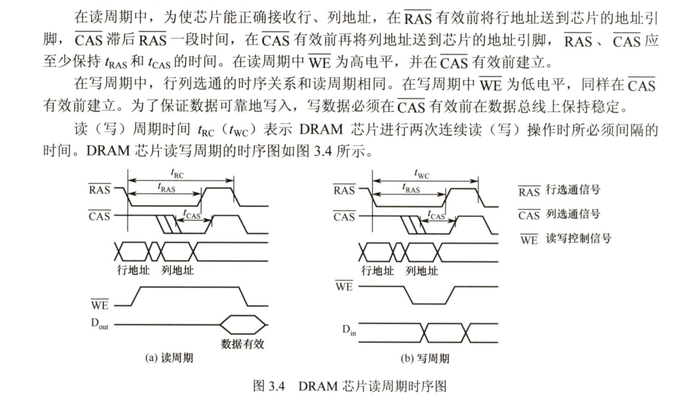
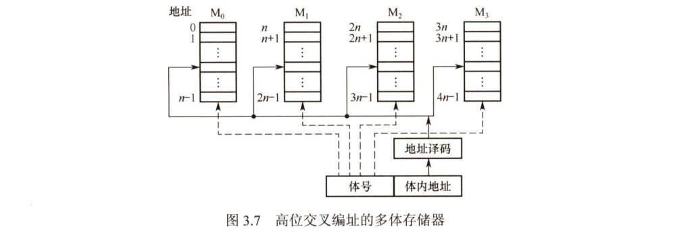
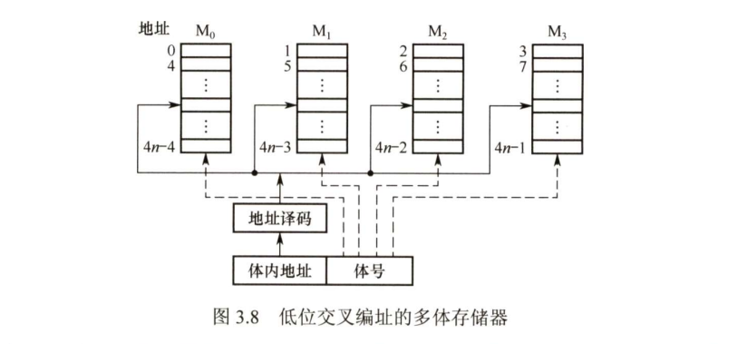
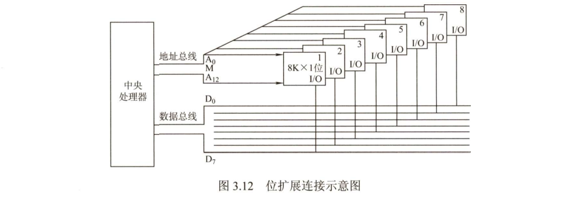
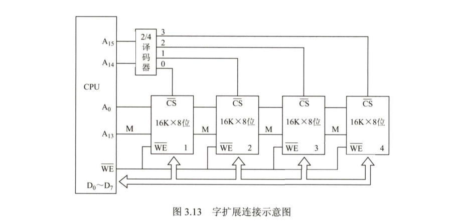
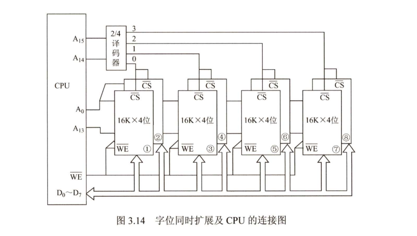
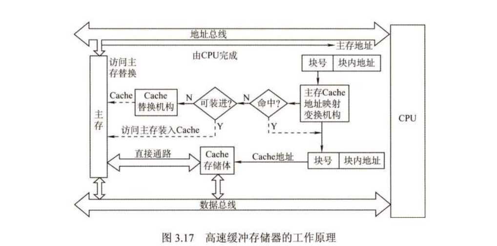
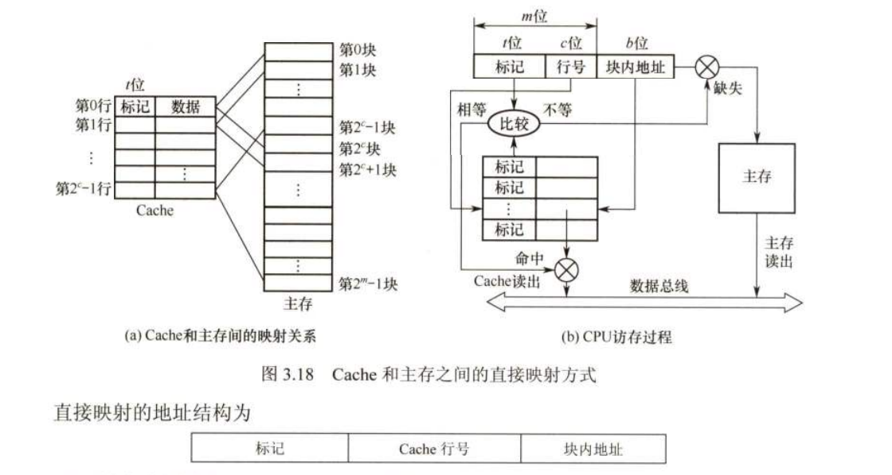
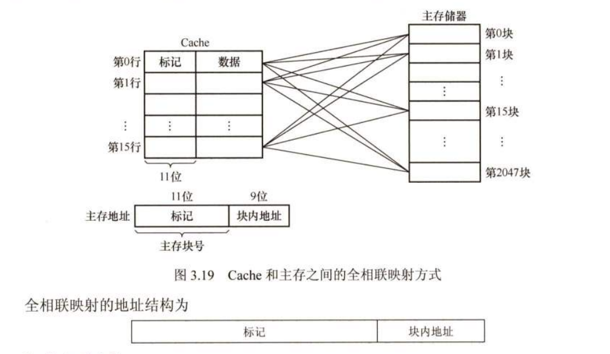
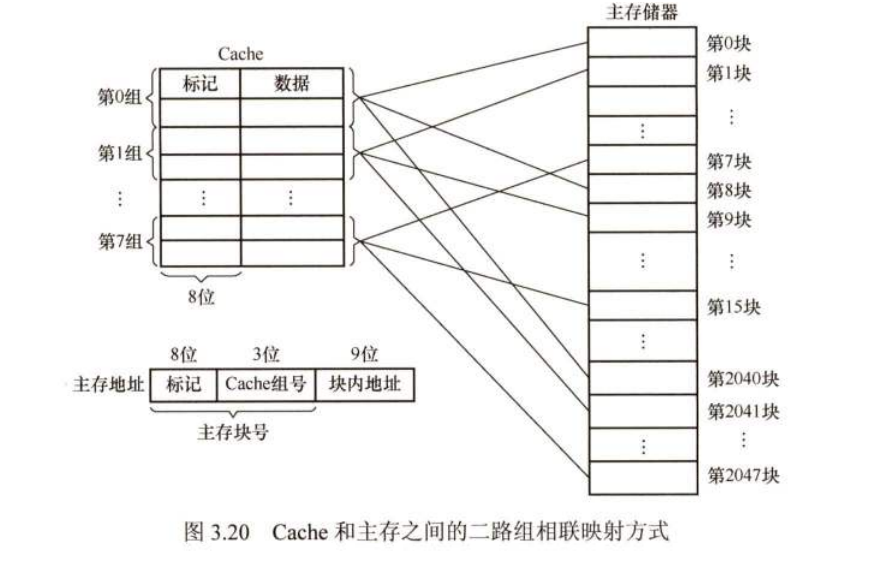

## 第 2 章 数据的表示和运算

### 2.3 浮点数的表示和运算

#### 2.3.1 浮点数的表示

**3. 浮点数的规格化**

尾数的位数决定浮点数的有效数位，有效数位越多，数据的精度越高。为了在浮点数运算的过程中尽可能多的保留有效数字的位数，使有效数字尽量占满尾数数位，必须在运算过程中对浮点数进行规格化操作。

**规格化操作：**是指通过调整一个非规格化浮点数的尾数和阶码的大小，使非零的浮点数在尾数的最高数位上保证是一个有效值。

 **左规：**当运算结果的尾数的最高数位不是有效位时，需要进行左规。左规时，尾数每左移一位、阶码减一（基数为2时），直至尾数变为规格化形式为止。左规可能会进行很多次。

**右规：**当运算结果的尾数的有效位进到小数点前面时，需要进行右规。将尾数右移一位、阶码加一，需要右规时，只需进行一次。

**4、IEEE 754 标准**

**32位单精度格式：**符号（1位）、阶码（8位）、尾数（23位），阶码偏置值127，尾数存在一个隐藏位，尾数实际有24位有效数字。

**64位双精度格式：**符号（1位）、阶码（11位）、尾数（52位），阶码偏置值为1023

阶码全零或全一有特别的解释（+0，-0，-∞，+∞）

**5、定点、浮点表示的区别**

（1）数值的表示范围

若定点数与浮点数的字长相同，则浮点表示法所能表示的数值范围远大于定点表示法。

（2）精度

对于字长相同的定点数和浮点数来说，浮点数扩大了数的表示范围，但是精度降低了

（3）数的运算

浮点数包括阶码和尾数两个部分，运算时不仅要做尾数的运算，还要做阶码的运算，运算结果要求规格化，比较复杂。

（4）溢出问题

在定点运算中，当运算结果超出书的表示范围时，发生溢出；浮点运算时，运算结果超出尾数表示范围却不一定溢出，只有规格化后阶码超过所能表示的范围时，才发生溢出。

#### 2.3.2 浮点数的加减运算

浮点数的加减运算分为以下几步：

**1、对阶**

对阶的目的是使两个操作数的小数点位置对齐，即使得两个数得阶码相等。为此，先求阶差，然后以小阶向大阶看起的原则，将阶码小的尾数右移一位，阶加一，直到两个数的阶码相等为止。尾数右移时，舍掉有效位会产生误差，影响精度。

**2、尾数求和**

将对阶后的尾数按定点数的加减运算规则运算。运算后的尾数不一定是规格化的，因此，浮点数的加减运算需要进一步进行规格化处理。

**3、规格化**

**4、舍入**

在对阶和尾数右规时，可能会对尾数进行右移，为保证运算精度，一般将低位移出的两位保留下来，参加中间过程的运算，最后将运算结果进行舍入。

常见的舍入方法有：0舍1入法、恒置1法、截断法。

**0舍1入法：**运算结果保留位的最高数位为0，则舍去；最高数位为1，则在尾数的末位加1.这样可能会使尾数溢出，此时需要再做一次右规。

**恒置1法：**只要因移位而丢失的位中有1，就把尾数末位置1，而不管原来是0还是1。

**截断法：**直接截取所需位数，丢弃后面所有的位。

**5、溢出判断**

若一个正指数超过了最大允许值（127或1023），则发生指数上溢，产生异常。若一个负指数超过了最小允许值（-149或-1074）则发生指数下溢，通常把结果当成0来处理。

1、右规和位数舍入时，需要检查是否溢出。

2、左规。

**6、C语言中的浮点数类型**

`char->int->long->double`和`float->double`强制类型转换没有精度损失。

- `int->float`  不会发生溢出，但是精度会受损失
- `double->float`  可能会发生溢出，可能精度会受到损失

#### 2.3.3 习题

**一、单选**

|  1   |  2   |  3   |  4   |  5   |
| :--: | :--: | :--: | :--: | :--: |
|  C   |  B   |  B   |  C   | B(C) |
|  6   |  7   |  8   |  9   |  10  |
|  B   |  C   | C(A) |  B   | A(D) |
|  11  |  12  |  13  |  14  |  15  |
|  D   |  D   |  D   | C(D) |  A   |
|  16  |  17  |  18  |  19  |  20  |
|  B   | A(D) |  D   |  D   |  C   |
|  21  |  22  |  23  |  24  |  25  |
| D(C) |  D   |  B   |  A   |  D   |
|  26  |  27  |  28  |  29  |  30  |
|  A   |  A   |  D   | B(A) |  A   |
|  31  |  32  |      |      |      |
|  A   |  A   |      |      |      |

## 第 3 章 存储系统

### 3.1 存储器概述

#### 3.1.1 存储器的分类

**1、按在计算机中的作用（层次）分类**

1）主存储器。简称主存，又称内存储器（内存）。可以直接被CPU访问。可以和高速缓冲存储器（Cache）及辅助存储器交换顺序。容量小，存取速度较快。

2）辅助存储器。简称辅存，又称外存储器（外存）。用来存放当前暂时用不到的程序和数据。需要调入主存后才可以被CPU访问。

3）高速缓冲存储器。简称Cache，位于主存和CPU之间，用来存放当前CPU经常使用的指令和数据，以便CPU可以高速的访问它们。Cache的存取速度可与CPU的速度相匹配，现代计算机通常将它们制作在CPU中。

**2、按存储介质分类**

按存储介质，存储器可以分为此表面存储器（磁带、磁盘）、磁芯存储器、半导体存储器和光存储器。

**3、按存取方式分类**

1）随机存储器（RAM）。存储器的任何一个存储单元都可以随机存取。

2）只读存储器（ROM）。存储器的内容只能随机读出而不能写入。

3）串行访问存储器。

**4、按信息的可保存性分类**

断电后，存储信息及消失的存储器，称为易失性存储器。断电后信息仍然保持的存储器称为非易失性存储器。

#### 3.1.2 存储器的性能指标

存储器有三个性能指标，即存储容量、单位成本和存储速度。

1）存储容量 = 存储字数✖️字长。

2）单位成本：每位价格 = 总成本 / 总容量。

3）存储速度：数据传输率 = 数据的宽度/存取周期。

- 存取时间（T~a~):存取时间是指从启动一次存储器操作到完成该操作所经历的时间，分为读出时间和写入时间。
- 存取周期（T~m~):存取周期又称读写周期或访问周期。它是指存储器进行一次完整的读写操作所需的全部时间，即连续两次独立访问存储器操作之间所需的最小时间间隔。
- 主存带宽（B~m~):主存带宽又称数据传输率，表示每秒从主存进出信息的最大数量。
- 存取周期 = 存取时间 + 恢复时间

#### 3.1.3 多级层次的存储系统

#### 3.1.4 习题

**一、单选**

|  1   |  2   |  3   |  4   |  5   |
| :--: | :--: | :--: | :--: | :--: |
| C(D) |  C   |  B   |  D   |  A   |
|  6   |  7   |  8   |  9   |  10  |
|  C   |  B   |  B   |  D   |  D   |
|  11  |  12  |  13  |  14  |  15  |
|  D   |  D   |  A   |  B   |      |

### 3.2 主存储器

#### 3.2.1 SRAM芯片和DRAM芯片

**1、SRAM的工作原理**

通常把存放一个二进制位的物理器件称为存储元，它是存储器的最基本的构件。地址码相同的多个存储元构成一个存储单元。若干个存储单元的集合构成存储体。

静态随机存储器（SRAM）的存储元是用双稳态触发器（六晶体管MOS）来记忆的，因此即使信息读出后，他仍保持其原状态而不需要再生（非破坏性读出）。

SRAM的存取速度快，但集成度低，功耗较大，价格昂贵，一般用于高速缓冲存储器。

**2、DRAM的工作原理**

动态随机存储器（DRAM）是利用存储元电路中栅极电容上的电荷来存储信息的，DRAM的基本存储元通常只是用一个晶体管，所以它比SRAM的密度要高很多。一般用于主存系统。

DRAM电容上的电荷一般只能维持1~2ms，因此即使电源不断电，信息也会自动消失。为此，每隔一定时间必须刷新，通常取2ms，成为刷新周期。常用的刷新方式有3种：

1. 集中刷新：在一个刷新周期内，利用一段固定的时间，依次对存储器的所有行进行逐一再生，在此期间停止对存储器的读写操作，成为“死时间”，又称访存“死区”。优点：读写操作时不受刷新工作的影响；缺点：再集中刷新期间不能访问存储器。
2. 分散刷新：把对每一行的刷新分散到各个工作周期中。优点：没有死区；缺点：加长了系统的存取周期，降低了整机的速度。
3. 异步刷新：结合上两种做法。将刷新周期除以行数，得到两次刷新操作之间的时间间隔t，利用逻辑电路每隔时间t产生一次刷新请求。

DRAM的刷新需注意以下问题：1、刷新对CPU是透明的，即刷新不依赖于外部访问；2、动态RAM的刷新单位是行，由芯片内部自行生成行地址；3、刷新操作类似于读操作，但又有所不同。

**3、DRAM芯片的读写周期**

**4、SRAM和DRAM的比较**

|            |   SRAM   |   DRAM   |
| :--------: | :------: | :------: |
|   存储元   |  触发器  |   电容   |
| 破坏性读出 |    非    |    是    |
|  需要刷新  |   不要   |   需要   |
| 送行列地址 |  同时送  | 分两次送 |
|  运行速度  |    快    |    慢    |
|   集成度   |    低    |    高    |
|  存储成本  |    高    |    低    |
|  主要用途  | 高速缓存 | 主机内存 |

**5、存储器芯片的内部结构**

#### 3.2.2 只读存储器

**1.只读存储器（ROM）的特点**

- 结构简单，所以位密度比可读写存储器高。
- 具有非易失性，可靠性高。

**2. ROM的类型**

根据制造工艺的不同，ROM可分为掩模式只读存储器（MROM）、一次可编程只读存储器（PROM）、可擦除可编程只读存储器（EPROM）、Flash存储器和固态硬盘（SSD）。

（1）掩模式只读存储器

MROM的内容由半导体制造厂按用户提出的要求在芯片生产过程中直接写入，写入以后任何人都无法改变其内容。

（2）一次可编程只读存储器

PROM是可以实现一次性编程的只读存储器。允许用户利用专门的设备（编程器）写入自己的程序，一旦写入，内容就无法改变。

（3）可擦除可编程只读存储器

EPROM不仅可以由用户利用编程器写入信息，而且可以对其内容进行多次改写。但它不能取代RAM，因为EPROM的编程次数有限，且写入时间过长。

（4）Flash存储器

Flash存储器可以在不加电的情况下长期保存信息。

（5）固态硬盘

由控制单元和存储单元（Flash芯片）组成。

#### 3.2.3 主存储器的基本组成

#### 3.2.4 多模块存储器

多模块存储器是一种空间并行技术，利用多个结构完全相同的存储模块的并行工作来提高存储器的吞吐率。常见的有单体多字存储器和多体低位交叉存储器。

**1. 单体多字存储器**

只有一个存储体，每个存储单元存储m个字，总线宽度也为m个字，地址必须顺序排列并处于同一个存储单元。

单体多字系统在一个存取周期内，从同一地址取出m条指令，然后将指令逐条送至CPU执行，即每隔1/m存取周期，CPU向主存取一条指令。缺点：指令和数据在主存内必须是连续存放的，一旦遇到转移指令，或操作数不能连续存放，这种方法的效果就不明显。

**2、多体并行存储器**

多体并行存储器由多体模块组成，每个模块都有相同的容量和存取速度，各模块都有独立的读写控制电路、地址寄存器和数据寄存器。它们既能并行工作也能交叉工作。

多体并行存储器分为高位交叉编址和低位交叉编制两种。

（1）高位交叉编址（顺序方式）

高位表示体号，低位为体内地址。

 高位交叉方式下，总是把低位的体内地址送到由高位体号确定的模块内进行译码。访问一个连续的主存块时，总是先在一个模块内进行访问，等到该模块访问完再访问下一个模块，CPU总是按顺序访问存储模块，各模块不能并行访问。

（2）低位交叉编址（交叉方式）

低位地址为体号，高位地址为体内地址。每个模块按“模m”交叉编址，模块号 = 单元地址 % m，假定有m个模块，每个模块有k个单元，则0，m，……，（k-1）m 单元位于M~0~；第1，m+1，……，（k-1）m+1 单元位于M~1~；以此类推。

使用这种方法可以在不改变每个模块存取周期的前提下，采用流水线的方式并行存取，提高存储器的带宽。设模块字长等于数据总线宽度，模块存取一个字的存取周期为T，总线传送周期为r，为实现流水线方式存取，存储器交叉模块数应大于等于 m = T/r，式中，m称为交叉存取度。每经过r时间延迟后启动下一个模块，交叉存储器要求其模块数必须大于等于m，以保证启动某模块后经过m×r的时间后再次启动该模块时，其上次存取操作已经完成（即流水线不间断），采用并行方式连续存取m个字所用时间为 T + （m-1）r 。

|  1   |  2   |  3   |  4   |  5   |
| :--: | :--: | :--: | :--: | :--: |
|  A   |  C   |  B   |  B   |  B   |
|  6   |  7   |  8   |  9   |  10  |
|  B   | B(C) |  D   | A(B) |  A   |
|  11  |  12  |  13  |  14  |  15  |
| D(C) | A(C) |  B   |  C   |  D   |
|  16  |  17  |  18  |  19  |  20  |
| D(B) |  C   | A(B) |  D   |  A   |
|  21  |  22  |  23  |  24  |  25  |
| B(A) |  A   |  B   | A(D) | B(C) |

### 3.3 主存储器与CPU的连接

#### 3.3.1 连接原理

- 主存储器通过数据总线、地址总线和控制总线与CPU连接
- 数据总线的位数与工作频率的乘积正比于数据传输率
- 地址总线的位数决定了可寻址的最大内存空间
- 控制总线（读、写）指出总线周期的类型和本次输入/输出操作完成的时刻。

#### 3.3.2 主存容量的扩展

由于单个存储芯片的容量是有限的，它在字数或字长方面与实际存储器的要求都有差距，因此需要在字和位两方面进行扩充才能满足实际存储器的容量要求。通常采用位扩展法、字扩展法和字位同时扩展法来扩充主存容量。

**1、位扩展法**

仅采用位扩展时，各芯片连接地址线的方式相同，但是连接数据线的方式不同，在同一时刻选中所有芯片，所以片选信号要连接到所有芯片。

**2、字扩展法**

字扩展法是指增加存储器中字的数量，而位数不变。字扩展将芯片的地址线、数据线、读写控制线相应并联，而由片选信号来区分各芯片的地址范围。

仅采用字扩展时，各芯片连接地址线的方式相同，连接数据线的方式也相同，但是在某一时刻只需选中部分芯片，所以片选信号采用译码器设计连接到相应芯片。

**3、字位同时扩展法**

实际上存储器往往需要同时扩充字和位。字位同时扩展是指既增加存储字的数量，又增加存储字长。

采用字位同时扩展时，各芯片连接地址线的方式相同，但连接数据线的方式不同，而且需要通过片选信号，采用译码器设计连接到相应芯片。

#### 3.3.3 存储芯片的地址分配和片选

CPU要实现对存储单元的访问，首先要选择存储芯片，即进行片选；然后为选中的芯片依地址码选择相应的存储单元，以进行数据的存取，即进行字选。片内的字选通常是由CPU送出的N条低位地址线完成的，地址线直接接到所有存储芯片的地址输入端。片选信号的产生分为线选法和译码片选法。

**1、线选法**

线选法用除片内寻址外的高位地址线直接分别接至各个存储芯片的片选端，当某地址线信息为“0”时，就选中与之对应的存储芯片。这些片选地址线每次寻址时只能有一位有效，不允许同时有多位有效，这样才能保证每次只选中一个芯片。优点：不需要地址译码器，线路简单。缺点：地址空间不连续，选片的地址线必须分时为低电平，不能充分利用系统的存储器空间，造成地址资源的浪费。

**2、译码片选法**

译码片选法用除片内寻址外的高位地址线通过地址译码器芯片产生片选信号。

#### 3.3.4 存储器与CPU的连接

**1、合理选择存储芯片**

要组成一个主存系统，选择存储芯片是第一步，主要指存储芯片的类型（RAM或ROM）和数量的选择。通常选用ROM存放系统程序、标准子程序和各类常数，RAM则是为用户编程而设置的。此外，在考虑芯片数量时，要尽量使连线简单、方便。

**2、地址线的连接**

存储芯片的容量不同，其地址线数也不同，而CPU的地址线数往往比存储芯片的地址线数要多。通常将CPU地址线的低位与存储芯片的地址线相连，以选择芯片中的某一单元（字选），这部分译码是由芯片的片内逻辑完成的。而CPU地址线的高位则在扩充存储芯片时使用，用来片选。

**3、数据线的连接**

CPU的数据线数与存储芯片的数据线数不一定相等，在相等时可以直接相连；在不相等时必须对存储芯片扩位，使其数据位数与CPU的数据线数相等。

**4、读写命令线的连接**

CPU读写命令线一般可直接与存储芯片的读写控制端相连，通常高电平为读，低电平为写。有些读写命令线是分开的。

**5、片选线的连接**

#### 3.3.5 习题

**一、单选**

|   1   |  2   |  3   |  4   |  5   |
| :---: | :--: | :--: | :--: | :--: |
|   D   | D(A) |  D   |  A   |  C   |
|   6   |  7   |  8   |  9   |  10  |
|   D   | B(A) |  C   |  D   |  B   |
|  11   |  12  |  13  |  14  |  15  |
| **D** |  D   | C(D) |  D   |  C   |
|  16   |  17  |      |      |      |
|   C   |  C   |      |      |      |

### 3.4 外部存储器

#### 3.4.1 磁盘存储器

磁盘存储器的优点：1、存储容量大，位价格低；2、记录介质可重复使用；3、记录信息可长期保存；4、非破坏性读出；缺点：存取速度慢，机械结构复杂，对工作环境要求较高。

**1、磁盘存储器**

（1）磁盘设备的组成

- 硬盘存储器的组成。硬盘存储器由磁盘驱动器、磁盘控制器和盘片组成。
    - 磁盘驱动器。核心部件是磁头组件和盘片组件，温彻斯特盘是一种可移动磁头固定盘片的硬盘存储器。
    - 磁盘控制器。硬盘存储器和主机的接口，主流标准有IDE、SCSI、SATA等。
- 存储区域。一块硬盘含有若干个记录面，每个记录面划分为若干磁道，而每条磁道有划分为若干个扇区，扇区（块）是磁盘读写的最小单位，即磁盘按块存取。
    - 磁头数：即记录面数，表示硬盘共有多少个磁头，磁头用于读取、写入盘片上记录面的信息，一个记录面对应一个磁头。
    - 柱面数：表示硬盘每面盘片上有多少条磁道。在一个盘组中，不同记录面的相同编号的诸磁道构成一个圆柱面。
    - 扇区数：表示每条磁道上有多少个扇区。

（2）磁记录原理

原理：磁头和磁性记录介质相对运动时，通过电磁转换完成读/写操作。

编码方法：按某种方案，把一连串的二进制信息变换成存储介质磁层中一个磁化翻转状态的序列，并使读写控制电路容易、可靠地实现转换。

磁记录方式：通常采用调频（FM）和改进型调频制（MFM）的记录方式。

（3）磁盘的性能指标

- 记录密度。记录密度是指盘片单位面积上记录的二进制信息量，通常以道密度、位密度和面密度表示。道密度是沿磁盘半径方向单位长度上的磁道数，位密度是磁道单位长度上能记录的二进制代码位数，面密度是位密度和道密度的乘积。
- 磁盘的容量。磁盘容量有非格式化容量和格式化容量之分。非格式化容量是指磁记录表面可利用的磁化单元总数，它由道密度和位密度计算而来。格式化容量是指按照某种特定记录格式所能存储信息的总量。
- 平均存取时间。平均存取时间由寻道时间（磁头移动到目的磁道的时间）、旋转延迟时间（磁头定位到要读写扇区的时间）和传输时间（传输数据所花费的时间）三部分构成。
- 数据传输率。磁盘存储器在单位时间内向主机传送数据的字节数，称为数据传输率。假设磁盘转数为r转/秒，每条磁道容量为N字节，则数据传输率为$D_{r} = rN$。

（4）磁盘地址

主机向磁盘控制器发送寻址信息，磁盘的地址一般如下图所示。

| 驱动器号 | 柱面（磁道）号 | 盘面号 | 扇区号 |
| :------: | :------------: | :----: | :----: |

（5）硬盘的工作过程

硬盘的主要操作是寻址、读盘、写盘。每个操作都对应一个控制字，硬盘工作时，第一步是取控制字，第二步是执行控制字。

硬盘属于机械式部件，其读写操作是串行的。

**2、磁盘阵列**

RAID（独立冗余磁盘阵列）是指将多个独立的物理磁盘组成一个独立的逻辑盘，数据在多个物理盘上分割交叉存储、并行访问，具有更好的存储性能、可靠性和安全性。

RAID的分级如下所示。

- RAID0：无冗余和无校验的磁盘阵列。
- RAID1：镜像磁盘阵列。
- RAID2：采用纠错的海明码的磁盘阵列。
- RAID3：位交叉奇偶校验的磁盘阵列。
- RAID4：块交叉奇偶校验的磁盘阵列。
- RAID5：无独立校验的奇偶校验磁盘阵列。

RAID0把连续多个数据块交替地存放在不同的物理磁盘地扇区中，几个磁盘交叉并行读写，不仅扩大了存储容量，而且提高了磁盘数据存取速度，但是RAID0没有容错能力。

RAID1使两个磁盘同时进行读写，互为备份，若一个磁盘出现故障，可从另一个磁盘读出数据。

#### 3.4.2 固态硬盘

固态硬盘（SSD）是一种基于闪存技术的存储器。他与U盘没有本质上地差别，只是容量更大，存取性能更好。一个SSD由一个或多个闪存芯片和闪存翻译层组成，闪存芯片代替传统旋转式磁盘中地机械驱动器，而闪存翻译层将来自CPU地逻辑块读写请求翻译成对底层物理设备地读写控制信号。

一个闪存由B块组成，每块由P页组成。通常，页地大小使512B\~4KB，每块由32\~128页组成，块的大小为16KB\~512KB。数据使以页为单位读写的。只有在一页所属的块整个被擦除后，才能写这一页。不过一旦一个块被擦除，块中的每个页都可以直接再写一次。

随机写很慢，有两个原因。首先，擦除块很慢，1ms级，比访问页高一个数量级。其次，如果写操作试图修改一个包含已有数据的页P~i~，那么这个块中所有含有用数据的页都必须被复制到一个新块中，才能进行对页P~i~的写。

#### 3.4.3 习题

**一、单选**

|  1   |  2   |  3   |  4   |  5   |
| :--: | :--: | :--: | :--: | :--: |
|  C   |  B   |  D   |  B   |  B   |
|  6   |  7   |      |      |      |
|  B   |  C   |      |      |      |

### 3.5 高速缓冲存储器

通常将存储体系分为“Cache-主存”层次和“主存-辅存”层次。

#### 3.5.1 程序访问的局部性原理

程序访问的局部性原理包括时间局部性和空间局部性。时间局部性是指最近的未来要使用到的信息，很可能是现在正在使用的信息，因为程序中存在循环。空间局部性是指在最近的未来要用到的信息，很可能与现在正在使用的信息在存储空间上是临近的，因为指令通常是顺序存放、顺序执行的。

高速缓冲技术就是利用局部性原理，把程序中正在使用的部分数据存放在一个高速的、容量较小的Cache中，使得CPU的访存操作大多数针对Cache进行，从而提高程序的执行速度。

#### 3.5.2 Cache的基本工作原理

Cache位于存储器层次结构的顶层，通常由SRAM构成，其基本结构入下图所示。

CPU与Cache之间的数据交换以字为单位，而Cache与主存之间的数据交换则以Cache块为单位。

CPU欲访问的信息在Cache中的比率称为Cache的命中率。设一个程序执行期间，Cache的总命中次数为N~c~，访问主存的总次数为N~m~，则命中率H为$H=N_c/(N_c+N_m)$

根据Cache的读、写流程，实现Cache时需解决以下关键问题：

1. 数据查找。如何快速判断数据是否在Cache中。
2. 地址映射。主存块如何存放在Cache中，如何将主存地址转换为Cache地址。
3. 替换策略。Cache满后，使用何种策略对Cache块进行替换或淘汰。
4. 写入策略。如何既保证主存块和Cache块的数据一致性，又尽量提升效率。

#### 3.5.3 Cache和主存的映射方式

**1、直接映射**

主存中的每一块只能装入Cache中的唯一位置。若这个位置已有内容，则产生块冲突，原来的块将无条件的被替换出去。直接映射的关系可定义为  Cache行号 = 主存块号 mod Cache总行数。

**2、全相联映射**

主存中的每一块可以装入Cache中的任何位置，每行的标记用于指出该行取自主存的哪一块。所以CPU访存时需要与所有Cache行的标记进行比较。全相联映射方式的优点就是比较灵活，Cache块的冲突概率低，空间利用率高，命中率也高。缺点是标记的比较速度较慢，实现成本较高，通常需采用昂贵的按内容寻址的相联存储器进行地址映射。

**3、组相联映射**

将Cache分成Q个大小相等的组，每个主存块可以装入固定组中的任意一行，即组间采用直接映射、而组内采用全相联映射的方式。当Q=1时，变为全相联映射，当Q=Cache行数时变为直接映射。假设每组有r个Cache行，则称之为r路组相联。

组相联映射的关系可以定义为 Cache组号 = 主存块号 mod Cache组数（Q）

#### 3.5.4 Cache中主存块的替换算法

常用的替换算法有随机（RAND）算法、先进先出（FIFO）算法、近期最少使用（LRU）算法和最不经常使用（LUF）算法。

1. 随机算法：随机地确定替换的Cache块。
2. 先进先出算法：选择最早调入的行进行替换。
3. 近期最少使用算法（LRU）：选择近期内长久未访问过的Cache行作为替换的行，是堆栈类算法。LRU算法对每个Cache行设置一个计数器，用计数值来记录主存块的使用情况，并根据计数值选择淘汰某个块。计数值的位数与cache组大小有关，2路时有一位LRU位，4路时有两位LRU位。
