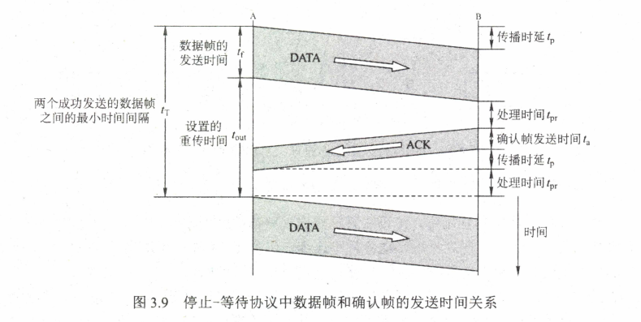

## 第 3 章  数据链路层

## 3.1 数据链路层的功能

数据链路层在物理层提供服务的基础上向网络层提供服务，其主要作用是加强物理层传输原始比特流的功能，将物理层提供的可能出错的物理连接改造为逻辑上无差错的数据链路，使之对网络层表现为一条无差错的链路。

#### 3.1.1 为网络层提供服务

对网络层而言，数据链路层的基本任务是将源主机中来自网络层的数据传输到目标主机的网络层。数据链路层为网络层提供如下服务：

1. 无确认的无连接服务（以太网）。
2. 有确认的无连接服务（无线通信）。
3. 有确认的面向连接服务。

#### 3.1.2 链路管理

数据链路层连接的建立、维持和释放过程成为链路管理，它主要面向连接的服务。

#### 3.1.3 帧定界、帧同步与透明传输

两台主机之间传递信息时，必须将网络层的分组封装成帧，以帧的格式进行传送。将一段数据的前后分别添加首部和尾部，就构成了帧。首部和尾部中含有很多控制信息，它们的一个重要作用是确定帧的界限，即帧定界。而帧同步指的是接收方应能从接收到的二进制比特流中区分出帧的起始于终止。每种数据链路层协议都规定了帧的数据部分的长度上限—最大传送单元（MTU）。

#### 3.1.4 流量控制

由于收发双方各自的工作速率和缓存空间的差异，可能出现发送方的发送能力大于接收方的接收能力的现象，因此这个过程需要通过某种反馈机制使发送方能够直到接收方能否跟上自己。对于数据链路层来说，控制的是相邻两节点之间数据链路的流量，而对于传输层来说，控制的则是从源端到目的端之间的流量。

在OSI体系结构中，数据链路层具有流量控制功能。而在TCP/IP体系结构中，流量控制功能被移到了传输层。

#### 3.1.5 差错控制

用以使发送者确定接收方是否正确收到由其发送的数据的方法成为差错控制。通常这些错误可分为位错和帧错。

位错指帧中某些位出现了差错。通常采用循环冗余校验（CRC）方式发现位错，通过自动重传请求（ARQ）方式来重传出错的帧。

#### 3.1.6 习题

**单选**

|  1   |  2   |  3   |  4   |  5   |
| :--: | :--: | :--: | :--: | :--: |
|  B   | C(D) |  D   |  C   |  A   |
|  6   |  7   |  8   |      |      |
|  A   | B(A) |  B   |      |      |

### 3.2  组帧

数据链路层之所以要把比特组合成帧为单位传输，是为了在出错时只重发出错的帧，而不必重发全部数据，从而提高效率。

#### 3.2.1 字符计数法

在帧头部使用一个计数字段来标明帧内字符数。

#### 3.2.2 字符填充的首尾定界法

字符填充法使用特定字符来定界一帧的开始与结束。（SOH、EOT）

#### 3.2.3 零比特填充的首尾标志法

使用一个特定的比特模式，01111110来标志一帧的开始和结束。为了不使信息位中出现的比特流01111110被误判成帧的首尾标志，发送方的数据链路层在信息位中遇到5个连续的1时，自动在其后面插入一个0。

零比特填充法很容易由硬件来实现，性能优于字符填充法。

#### 3.2.4 违规编码法

 曼彻斯特编码方法将数据比特1编码成高-低电平对，将数据比特0编码成低高电平对，而高高电平对和低低电平对在数据比特中是违规的，可以借用这些违规编码序列来定界帧的起始和终止。局域网IEEE 802标准就采用了这种方法。只适用于采用冗余编码的特殊编码环境。目前较为常见的组帧方法是零比特填充法和违规编码法。

### 3.3 差错控制

通常利用编码技术进行差错控制，主要有两类：自动重传请求ARQ和前向纠错FEC。在ARQ方式中，接收端检测到差错时，就设法通知发送端重发，直到接收到正确的码字为止。在FEC方式中，接收端不但能发现差错，而且能确定比特串的错误位置，从而加以纠正。

#### 3.3.1 检错编码

**1、奇偶校验码**

**2、循环冗余码**

给定一个m bit的帧或报文，发送器生成一个`r bit`的序列，称为帧校验序列（FCS）。这样所形成的帧将有`m+r`比特组成。发送方和接收方事先商定一个多项式`G(x)`，使这个带校验码的帧刚好能被预先确定的多项式`G(x)`整除。

假设一个帧有m位，其对应的多项式为`M(x)`，则计算冗余码的步骤如下：

1. 加0 。假设`G(x)`的阶为r，在帧的低位端加上`r`个0 。
2. 模2除。 利用模2除法，用`G(x)`对应的数据串除去1.中计算出的数据串，得到的余数即为冗余码（共r位，前面的0不可省去）

循环校验码是具有纠错功能的，但是数据链路层只使用了它的检错功能。

#### 3.3.2 纠错编码

最常见的纠错编码是海明码，其实现原理是在有效信息位中加入几个校验位形成海明码，并把海明码的每个二进制位分配到几个奇偶校验组中。当某一位出错后，就会引起有关的几个校验位的值发生变化，这不但可以发现错位，而且能指出错位的位置。

1. 确定海明码的位数。设n为有效信息的位数，k为校验位的位数，则信息位n和校验位k应满足
    $$
    n+k \leq 2^k - 1
    $$
    若要检测两位错，则需再增加1位校验位，即`k+1`位）

2. 确定校验位的分布。规定校验位P~i~在海明位号为$2^{i-1}$的位置上，其余各位为信息位。

3. 分组以形成校验关系。

4. 校验位取值。

#### 3.3.3 习题

**一、单选**

|  1   |  2   |  3   |  4   |  5   |
| :--: | :--: | :--: | :--: | :--: |
| D(A) |  A   |  A   | A(D) | B(D) |
|  6   |  7   |  8   |      |      |
|  B   |  B   |  B   |      |      |

### 3.4 流量控制与可靠传输机制

#### 3.4.1 流量控制、可靠传输与滑动窗口机制

流量控制涉及对链路上的帧的发送速率的控制，以使接收方有足够的缓冲空间来接收每个帧。常见的方式有两种：停止等待协议和滑动窗口协议。

**1、停止-等待协议**

发送方每发送一帧，都要等待接收方的应答信号，之后才能发送下一帧；接收方每接收一帧，都要反馈一个应答信号，表示可接受下一帧，如果接收方不反馈应答信号，那么发送方必须一直等待。因而效率很低。

**2、滑动窗口流量控制基本原理**

在任意时刻，发送方都维持一组连续的允许发送的帧的序号，称为发送窗口。同时接收方也维持一组连续的允许接收帧的序号，称为接收窗口。发送窗口用来对发送方进行流量控制，而发送窗口的大小W~T~代表在还未收到对方确认信息的情况下发送方最多还可以发送多少个数据帧。在接收端设置接收窗口是为了控制可以接收哪些数据帧和不可以接收哪些数据帧。在接收方，只有收到的数据帧的序号落入接收窗口内时，才允许该数据帧收下。如果收到的数据帧落在接收窗口之外，则一律将其丢弃。

滑动窗口有以下重要特性：

1. 只有接收窗口向前滑动（同时接收方发送了确认帧）时，发送窗口才有可能向前滑动。
2. 从华东窗口的概念看，停止-等待协议、后退N帧协议和选择重传协议只是在发送窗口大小与接收窗口大小上有所差别：停止等待协议：发送窗口=1，接收窗口=1；后退N帧协议：发送窗口>1，接收窗口=1；选择重传协议：发送窗口>1,接收窗口>1.
3. 接收窗口的大小为1时，可保证帧的有序接收。
4. 数据链路层的滑动窗口协议中，窗口的大小在传输过程中时固定的。

**3、可靠传输机制**

数据链路层的可靠传输通常使用确认和超时重传两种机制来完成。自动重传请求（ARQ）通过接收方请求发送方重传出错的数据帧来恢复出错的帧，是通信中用于处理信道所带来差错的方法之一。传统自动重传请求分为三种，

即停止-等待、后退N帧和选择性重传。后两种称为连续ARQ协议。

#### 3.4.2 单帧滑动窗口与停止-等待协议

在停止等待协议中，除数据帧丢失外，还可能出现以下两种错误。

到达目的站的帧可能已遭受破坏，接收站利用前面讨论的差错检测计数检出后，简单地将该帧丢弃。为了对付这种可能地情况发生，源站装备了计时器。在一个帧发送后，源站等待确认，若在计时器计满时仍未收到确认，就再次发送相同的帧。

另一种错误时数据帧正确而确认帧被破坏，此时接收方已经收到正确地数据帧，但是发送方收不到确认帧，因此发送方会重传已被接收地数据帧，接收方收到同样地数据帧时会丢弃该帧，并重传一个该帧对应的确认帧。发送帧交替地用0和1来标识，确认帧分别用ACK0和ACK1来表示，收到的确认帧有误时，重传已发送的帧。对于停止-等待协议，若连续出现相同发送序号地数据帧，表明发送端进行了超时重传。连续出现相同序号地确认帧时，表示接收端收到了重复帧。

此外，为了超时重发和判定重复帧地需要，发送方和接收方都须设置一个帧缓冲区。发送端在发送完数据帧时，必须在其发送缓存中保留此数据帧地副本，这样才能在出差错时进行重传。只有在收到对方发来地确认帧ACK时，方可清楚副本。

#### 3.4.3 多帧滑动窗口与后退N帧协议（GBN）

在后退N帧式ARQ中，发送方无须在收到上一个帧地ACK后才能开始发送下一帧，而是可以连续发送帧。当接收方检测出失序地信息帧后，要求发送方重发最后一个正确接受的信息帧之后地所有未被确认地帧。或者当发送方发送了N个帧后，若发现该N个帧的前一个帧在计时器超时后仍未返回其确认消息，则该帧被判为出错或丢失，此时发送方就不得不重传该出错帧及随后的N个帧。

累积确认：对某一数据帧的确认就表明该数据帧和此前所有的数据帧均已正确无误地收到。若采用n比特对帧编号，则其发送窗口地尺寸$W_T$应满足$1<W_T\leq2^n-1$。若发送窗口尺寸大于$2^n-1$，则会造成接收方无法辨认新帧和旧帧。

#### 3.4.4 多帧滑动窗口与选择重传协议（SR）

接收窗口和发送窗口的大小往往是相同的，一次可以发送或接收多个帧。若采用n比特对帧编号，则需要满足$W_{Tmax}=W_{Rmax}=2^{(n-1)}$。因为如果不满足该条件，即窗口大小大于序号范围的一半，当一个或多个确认帧丢失时，发送方就会超时重传之前的数据帧，但接收方无法分辨是新的数据还是重传的数据。

#### 3.4.5 习题

**一、单选**

|  1   |  2   |  3   |  4   |  5   |
| :--: | :--: | :--: | :--: | :--: |
|  C   |  D   |  D   |  D   |  C   |
|  6   |  7   |  8   |  9   |  10  |
|  C   |  B   |  C   |  D   | CDA  |
|  11  |  12  |  13  |  14  |  15  |
|  C   |  B   |      |      |      |
|      |      |      |      |      |
|      |      |      |      |      |

